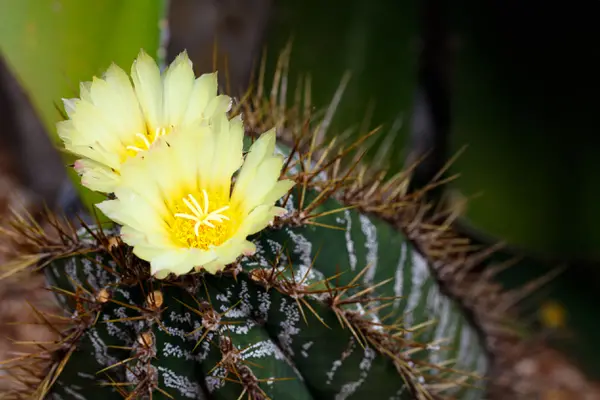
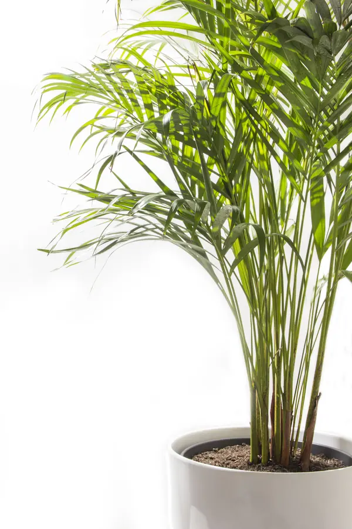

### What could be more delightful than plants to furnish your interior? With this selection of plants easy to maintain, your guests will envy your interior!

## The desert rose

Its capricious contours have been known for a long time in the Middle East and Africa. The red and white flowers, which sometimes bloom twice a year, will seduce you. Give it a sunny location, it will be grateful to you for blossoming beautifully.

- Height: 30 cm
- Exposure: sunny location recommended

## Astrophytum ornatum

This very graphic cactus is the largest of all astrophytum. Its spherical body becomes cylindrical as it ages. It has very variable thorns, yellow, brown or black. Its epidermis is green and not very flaky. Large yellow flowers appear on older plants throughout the summer. This cactus is part of the depolluting plants by acting against electromagnetic waves.

- Cultivation: normal to sandy soil, very easy to maintain

## The braided ficus

Bring a note of greenery in your interior with a large and beautiful green plant! Native to Asia, ficus benjamina forms a small graceful tree that can reach more than 2 meters in height. These slightly weeping (drooping) twigs have leathery, lustrous leaves that change colors from medium green to dark green. Its braided trunk gives it a little note of originality. The ficus benjamina appreciates a bright space but must not be exposed to direct sun. It is also a depolluting plant for formaldehyde, xylene, ammonia, toluene, benzene and trichlorethylene.

- Exposure: enjoy a bright space but should not be exposed to direct sunlight
- Height: 180 cm

## Croton

The croton is a tropical plant, native to the Indonesian archipelago. With its flamboyant colors, the croton plays a little the role of a bouquet among the green plants, of which it does not deserve the term. It is rare that crotons exceed 1 meter high. The leaves of this plant, oval and leathery, more or less cut, are very colorful. Their colors range from bright yellow to bronze red to green and pink. Depending on the variety, they take different thin, wide shapes, embossed or smooth textures and stained or zebra variegations.

- Exposure: to keep its colors, the plant must benefit from a bright light.
- Croton supports the morning sun
- Height: 40 cm

## The areca

This voluble plant will be particularly suitable for your newly renovated rooms. The areca is indeed an effective depollutant which eliminates xylene and formaldehyde from your rooms. If she does not like direct sunlight, she cannot stand the cold and enjoys a temperature varying between 18 ° C and 22 ° C. In order to remove the dust which can quickly accumulate on its fine leaves and avoid the invasion of parasites , clean regularly with a damp cloth.

- Height: 1.5 to 3 m
- Exposure: sunny or partial shade

## Sarracenia leucophylla

This amazing and ingenious plant will find its place in contemporary and refined interiors. A substance produced inside the leaves in the form of tubes or urns with a cap attracts insects and makes it a fascinating carnivorous plant to observe.

Sarracenia © supathral / 123rf

## The "Anita" leomele

Native to Madagascar, this pretty tropical plant is relatively new. Its fine green leaves growing in compact tufts on erect stems make this "Anita" variety a particularly decorative and exotic plant.

- Exposure: partial shade
- Height: 110-120 cm

